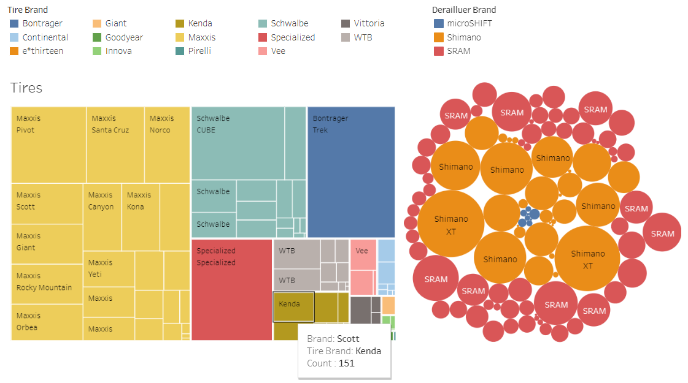

# Bike_Analysis

The goal of this repository is to demonstrate the use of technology and coding and how it drastically improves the time to do market research.

Working with 99Spokes API.

With the help of the 99spokes web scraping site and the API they built, with access, I wrote a python script that can loop through the dataset and export it to a CSV file. From there, I can use powerful tools such as Tableau to create visuals and views that allow users to drill into the data.Example:

If I am reviewing this chart and want to learn more about the competitive landscape of bikes using a particular drivetrain series, I can select it from the chart and pull up the data.  In the example below, I was curious about what Trail bikes used Shimano XTR Rear Derailleurs in 2022. 

https://public.tableau.com/app/profile/nicholas.erdos.thayer/viz/MountainBikeAnalysis/MountainBikeTrends
